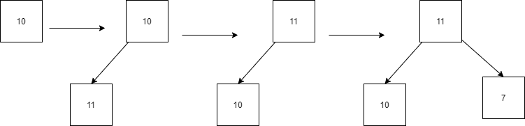
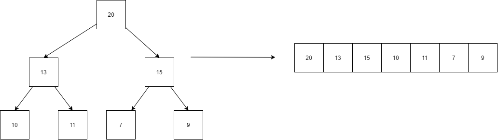

# Heap
It is a binary tree in which any node is always smaller or greater than all of its 
children.   If we remove a node from the tree head, it will adjust in such a 
way that the whole tree will again form a system that each node will be smaller or 
larger than its children.

### Max Heap
In max heap, each node is greater than its children.

### Min Heap
In min heap, each node is smaller than its children.

## Insert Mechanism
### Max Heap
Let's say the values are = `[10, 11, 7, 15, 13]`
Initially 10 will be the head. Then it finds 11, the 11 will be at the top and 10 
will be 11's child. Now, 7 is less than the 11. So, 7 will be inserted as 11's 
child.    
   
  After that, 15 will be inserted after 10. Then it will check its parent if it 
is greater than its parent. If it is greater, it will swap with its parent and this 
process will propagate until it reaches to the head.    
.png "Insert in Heap") 
   
After that, 13 will be inserted after 11. Then it will check its parent if it 
is greater than its parent. If it is greater, it will swap with its parent and this 
process will propagate until it reaches to the head.    
.png "Insert in Heap") 
   
## How To Store Data
We know that the heap is a complete binary tree. We will use an array to store the values of 
the Heap.    
 
  
### Reach to children
We can go to an element from a node `i` via `2*i+1` and `2*i+2` these two indexes. 
### Reach to parent
We can go to the parent of a node by `(i - 1) / 2`.    
For Min heap, we will do all these things in exactly opposite manner. 